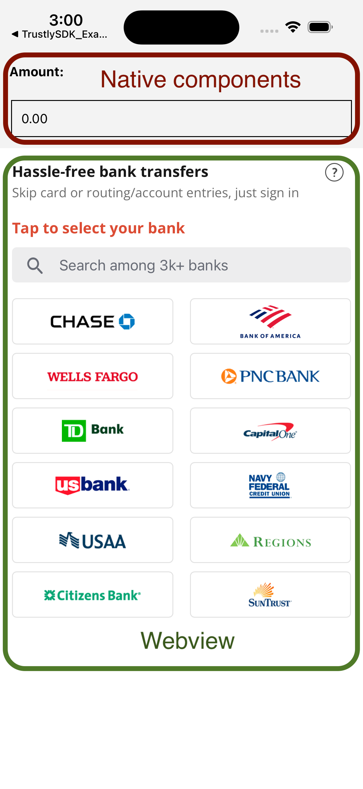

# Trustly React Native Example

This example application demonstrates how the Trustly UI can be integrated with a React Native app. In addition to this example, also see the Trustly developer docs for [React Native](https://amer.developers.trustly.com/payments/docs/react-native) apps.

## Getting Started

### 1. Clone this repository

```shell
git clone git@github.com:TrustlyInc/trustly-react-native-example.git
```

### 2. Install dependencies

```shell
cd trustly-react-native-example && npm install
cd ios && pod install
```

### 3. Copy the `env.example.ts` file to a new `env.ts` file and fill out your environment variables

### 4. Start the app!

`npm start` or `npx react-native start` (if you don't have `react-native-cli` installed)

## How it works

Integrations in React Native must inform the `integrationContext` parameter with the value `InAppBrowserNotify` in the `establishData`, as in the example below:

```javascript
let establishData = {
  ...
  metadata:{
    integrationContext: "InAppBrowserNotify",
    ...
  },
  ...
};
```

After that, when an OAuth bank is selected in the Trustly Lightbox, a message will be triggered and must be captured by the `onMessage` attribute of the WebView, as in the example below (and in the `App.tsx` file):

```js
<WebView
  ...
  onMessage={this.handleOAuthMessage}
  ...
/>
```

The function informed in `onMessage` will receive the message with a URL that must be opened in an in-app browser, as in the example below (and in the `App.tsx` file):

```javascript
handleOAuthMessage = (message: any) => {
  const data = message.nativeEvent.data

  if ( typeof data !== 'string') return;

  var [command, ...params] = data.split("|");

  if(command.includes("ExternalBrowserIntegration")) {
    var messageUrl = params[1]

    if( shouldOpenInAppBrowser(messageUrl) ) {
      this.openLink(messageUrl);
    }
  }
}
```

## Closing Chrome Custom Tabs on Android

### RedirectActivity

When the application receives some action like `in-app-browser-rn` (or any name that you defined in the `urlScheme`), it will call your target `Activity` with some flags, and reload it.

The example below is from `RedirectActivity`:

```java
Intent intent = new Intent(getApplicationContext(), MainActivity.class);
intent.addFlags(Intent.FLAG_ACTIVITY_CLEAR_TOP | Intent.FLAG_ACTIVITY_SINGLE_TOP);
startActivity(intent);
finish();
```

### AndroidManifest

```xml
<activity
  android:name=".RedirectActivity"
  android:exported="true">
    <intent-filter>
      <action android:name="android.intent.action.VIEW" />
      <category android:name="android.intent.category.DEFAULT" />
      <category android:name="android.intent.category.BROWSABLE" />
      <data android:scheme="in-app-browser-rn" />
    </intent-filter>
</activity>
```

## How to integrate native components with Trustly WebView

Trustly UI offers two types of user experiences that can be configured to fit your application. The primary method is to render the Select Bank Widget (shown below) which allows users to quickly search for and select a bank to begin the authorization process. See the [Trustly UI docs](https://amer.developers.trustly.com/payments/docs/sdk#select-bank-widget) for more details.



In this case, we need to avoid the Widget calling the Lightbox immediately when the user selects a bank because we need to get the `amount` value to fill the `establishData` first. To achieve this, we need to add a piece of JavaScript inside the Widget (as in the `trustly.tsx` file).

```js
const TrustlyWidgetBankSelected = (data) => {
  return false;
}

Trustly.selectBankWidget(establishData, TrustlyOptions, TrustlyWidgetBankSelected);
```

Now, you must implement in your WebView a way to handle the 3 events triggered by the Widget and Lightbox to handle the bank selection, close or cancel action, and when the authorization ends.

- Bank selection event (`PayWithMyBank.createTransaction`): In this demonstration app, after selecting the bank, we redirect the user to the authentication page.

```js
handlePaymentProviderId(data: string) {
  if (data.startsWith('PayWithMyBank.createTransaction')) {
    let splitData = data.split('|')

    this.establishData.amount = this.state.amount;
    this.establishData.paymentProviderId = splitData[1];

    this.goToAuthBankSelected();
  }
}

goToAuthBankSelected = () => {
  this.setState({ step: 'lightbox' });
}
```

- Close or cancel event (`close|cancel|`):

```js
handleWithCancelOrClose(data: string) {
  if(data.endsWith('close|cancel|')) {
    this.setState({ step: 'widget' });
  }
}
```

- Finish authorization event (`PayWithMyBank.closePanel|`):

```js
handleClosePanelSuccess(data: string) {
  if (data.startsWith('PayWithMyBank.closePanel|')) {
    let returnValues = data.split('|')[1];
    let returnParameters = returnValues.split('?')[1];

    this.setState({
      returnParameters: returnParameters,
      step: 'success'
    });

  }
}
```

## Server Side Features

This example project can be run entirely as a frontend app in order to quickly test basic Trustly functions. However, your application will likely require backend integration with Trustly as well. Check out our [trustly-nestjs-example](https://github.com/TrustlyInc/trustly-nestjs-example) project to learn more and follow the steps below to integrate it with this app.

### Request Signature

Documentation: [Securing Requests](https://amer.developers.trustly.com/payments/docs/securing-requests)

1. Clone and run the [trustly-nestjs-example](https://github.com/TrustlyInc/trustly-nestjs-example), in case you don't have a request signature server set
2. Add the request signature endpoint (e.g. `http://localhost:8080/signature` in the NestJS Example) into the `SIGNATURE_API_URL` variable of the `env.ts` file
3. Uncomment the `getRequestSignature` code snippet in the `trustly.tsx` file
4. Run your app

# Contributing

You can participate in this project by submitting bugs and feature requests in the [Issues](https://github.com/TrustlyInc/trustly-react-native-example/issues) tab. Please, add [@lukevance](https://github.com/lukevance) as an assignee.

If you are interested in fixing issues and contributing directly to the code base, feel free to open a Pull Request with your changes. Please, make sure to fulfill our [Pull Request Template](https://github.com/TrustlyInc/trustly-react-native-example/blob/main/.github/pull_request_template.md) and add [@lukevance](https://github.com/lukevance) as code reviewer.
